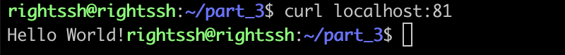
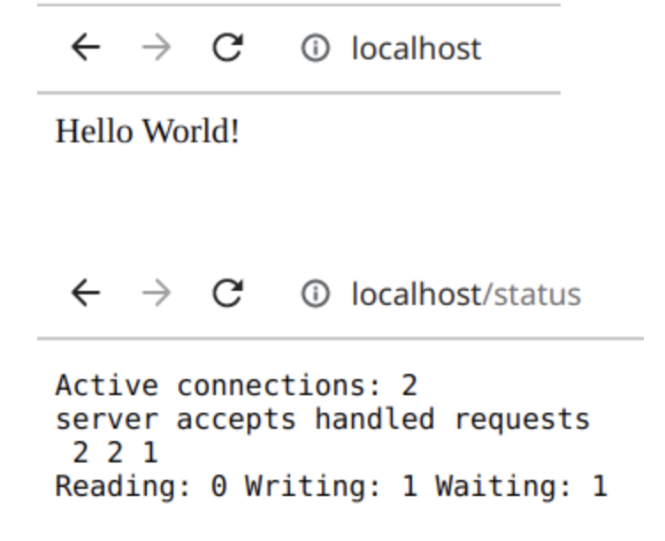

## Part 1. Готовый докер
`` - 1.1 Взять официальный докер образ с nginx и выкачать его при помощи docker pull`` 

``docker pull nginx``

  

`` - 1.2 Проверить наличие докер образа через docker images``

``команда - docker images``

  

``- 1.3 Запустить докер образ через docker run -d [image_id|repository]``

``команда - docker run -d 89da1fb6dcb9``

  

`` - 1.4 Проверить, что образ запустился через docker ps``

``sudo docker ps``

  

`` - 1.5 Посмотреть информацию о контейнере``

  

``- 1.6 По выводу команды определить и поместить в отчёт размер контейнера, список замапленных портов и ip контейнера``

`` sdo docker inspect ac50300768ed --size | grep -i SizeRw``

  

``найдём в выводе команды sudo docker inspect  список портов``

  

`` найдём ip контейнера командой sudo docker inspect ac50300768ed --size | grep -i ip``

  

`` - 1.7 Остановить докер образ через docker stop ac50300768ed ``

  

`` - 1.8 Проверить, что образ остановился через docker ps``

  

`` - 1.9 Запустить докер с замапленными портами 80 и 443 на локальную машину через команду run``

``sudo docker run -d -p 80:80 -p 443:443 nginx``

  

`` проверяем запуск и порты sudo docker ps``

  

`` - 1.10 Проверить, что в браузере по адресу localhost:80 доступна стартовая страница nginx``

  

## Part 2. Операции с контейнером

``- 2.1 Прочитать конфигурационный файл nginx.conf внутри докер контейнера через команду exec``

``используем команду sudo docker exec 5c02c59c7852 cat /etc/nginx/nginx.conf``

  

`` - 2.2 Создать на локальной машине файл nginx.conf``

  

`` - 2.3 Настроить в нем по пути /status отдачу страницы статуса сервера nginx``

  

`` - 2.4, 2.5 Скопировать созданный файл nginx.conf внутрь докер образа через команду docker cp``

``копируем файл командой sudo docker cp nginx.conf 6c86bc252e0e:etc/nginx/``
``Перезапустить nginx внутри докер образа через команду exec``
``docker exec 6c86bc252e0e nginx -s reload``

  

`` -2.6 Проверить, что по адресу localhost:80/status отдается страничка со статусом сервера nginx``

  

``- 2.7 Экспортировать контейнер в файл container.tar через команду export``

``sudo docker export -o container.tar 6c86bc252e0e``

  

``- 2.8 Остановить контейнер``

``sudo docker stop 6c86bc252e0e``

  

`` - 2.9 Удалить образ через docker , не удаляя перед этим контейнеры``

``удаляем образ командой sudo docker rmi -f nginx``

  

`` - 2.10 Удалить остановленный контейнер``
``удаляем контейнер командой sudo docker rm 6c86bc252e0e``

  

`` - 2.11 Импортировать контейнер обратно через команду import``

``sudo docker import -c 'CMD ["nginx", "-g", "daemon off;"]' container.tar part_2``

  

`` - 2.12 Запустить импортированный контейнер``

``запускаем контейнер командой sudo docker run -d -p 80:80 -p 443:443 part_2``

  

`` - 2.13 Проверить, что по адресу localhost:80/status отдается страничка со статусом сервера nginx``

  

## 3. Мини веб-сервер

`` - 3.1 Пишу мини сервер на C и FastCgi, который будет возвращать простейшую страничку с надписью Hello World!``

  

`` - 3.2 3.2 Написать свой nginx.conf, который будет проксировать все запросы с 81 порта на 127.0.0.1:8080``

  

`` - 3.3 Запустить написанный мини сервер через spawn-fcgi на порту 8080``

``docker pull nginx``
``docker images``
``docker run -d -p 81:81 89da1fb6dcb9``
``docker ps``

  

`` - 3.4 Заходим в контейнер командой docker exec -it 521cee2f0888 bash, обновляем репозитории, устанавливаем gcc, spawn-fcgi и libfcgi-dev``

``docker cp nginx.conf 521cee2f0888:/etc/nginx/``
``docker cp server.c 521cee2f0888:/home/``
``docker exec -it 521cee2f0888 bash     // чтобы подключиься к контейнеру``

  

``gcc *.c -lfcgi``
``spawn-fcgi -p 8080 /screenshots/a.out``
``nginx -s reload``

  

``- 3.4 Проверить, что в браузере по localhost:81 отдается написанная вами страничка``

  

  

## 4. Свой докер

``Dockerfile``

  

``скрипт, выполняющий роль run.sh``

  

``Собираем образ через docker build при этом указав имя и тег``

  

``проверяем через docker images, что все собралось корректно``

  

``Дописать в /screenshots/nginx/nginx.conf проксирование странички /status, по которой надо отдавать статус сервера nginx``

  

``Перезапустить докер образ``

  

  

## 5. Dockle

`` Для начала устанавливаем dockle``

  

``потом проверим образ``

  

``устроняем ошибку``

  

``еще раз проверяем``

  

## 6. Базовый Docker Compose

``Написать файл docker-compose.yml, с помощью которого:``

``Поднять докер контейнер из Части 5 (он должен работать в локальной сети, т.е. не нужно использовать инструкцию EXPOSE и мапить порты на локальную машину)``

``Поднять докер контейнер с nginx, который будет проксировать все запросы с 8080 порта на 81 порт первого контейнера``

  

``Замапить 8080 порт второго контейнера на 80 порт локальной машины``

  

``Собрать и запустить проект с помощью команд docker-compose build и docker-compose up``
  

  

``Проверить, что в браузере по localhost:80 отдается написанная вами страничка, как и ранее``

  

t